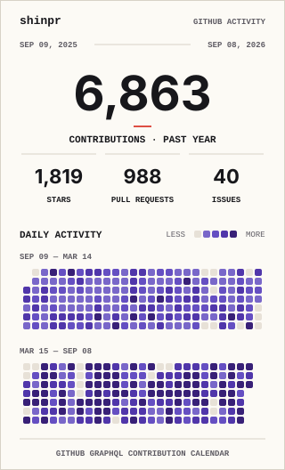
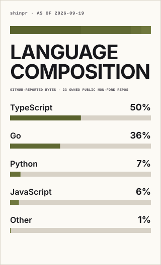

## shinpr

### About
Deep expertise in agentic coding and the LLM ecosystem.

Building workflow tools and utilities through hands-on agentic development,
fully delegating to coding agents, addressing real-world challenges as they arise,
and transforming those insights into practical solutions. Also working on
AI-native workflows beyond software development.

Through ongoing personal projects, delivering tools grounded in actual practice
rather than speculation.

Sharing learnings through writing.

Latest: [When Better Models Make Old Agent Workflows Worse](https://www.norsica.jp/blog/when-better-models-make-old-agent-workflows-worse)

### Projects

**🛠 Agentic Development Frameworks**

- [claude-code-workflows](https://github.com/shinpr/claude-code-workflows) - Keeps Claude Code focused on the result you agreed on, even when complex work uncovers tempting side issues
- [codex-workflows](https://github.com/shinpr/codex-workflows) - Keeps Codex from turning a focused request into extra features, settings, and complexity while still delivering what you asked for
- [grok-workflows](https://github.com/shinpr/grok-workflows) - Use claude-code-workflows on Grok without maintaining a separate copy of its design, implementation, and review workflows
- [galley](https://github.com/shinpr/galley) - Makes lower-cost or specialized coding models practical by pairing them with independent supervision and review-ready PRs
- [ai-coding-project-boilerplate](https://github.com/shinpr/ai-coding-project-boilerplate) - Start a TypeScript project with a Claude Code setup your team can version, share, and use from design through verification
- [claude-code-discover](https://github.com/shinpr/claude-code-discover) - Helps you decide what to build by testing the assumptions that matter, then carries the evidence into an implementation-ready PRD
- [linear-prism](https://github.com/shinpr/linear-prism) - Turns requirements into a small set of Linear tasks that people or coding agents can pick up and verify independently
- [nautilus](https://github.com/shinpr/nautilus) - Keeps product discovery context in your repo as you move from rough questions to prototypes and evidence-backed PRDs in Cursor, Codex, or OpenCode

**🔌 MCP Servers**

- [mcp-local-rag](https://github.com/shinpr/mcp-local-rag) - Search private documents without sending them to an embedding service, while still finding related ideas and exact technical terms
- [mcp-image](https://github.com/shinpr/mcp-image) - Turns rough image requests into stronger prompts without losing your intent, then generates or edits the result
- [sub-agents-mcp](https://github.com/shinpr/sub-agents-mcp) - Run reusable task-specific agents from any MCP client, using the coding backend you choose

**🧰 Utilities**

- [github-profile-stats](https://github.com/shinpr/github-profile-stats) - Publish GitHub profile cards from your own repository, with no hosted renderer to depend on
- [metronome](https://github.com/shinpr/metronome) - Claude Code plugin that catches shortcut-taking behavior and keeps Claude working step by step
- [pr-review-skill](https://github.com/shinpr/pr-review-skill) - Gives every reviewer the same complete PR snapshot, then lets you approve findings before they are posted
- [rashomon](https://github.com/shinpr/rashomon) - Tests whether a prompt or skill actually improves agent behavior before you ship it
- [sub-agents-skills](https://github.com/shinpr/sub-agents-skills) - Build reusable custom agents using 10+ AI coding options, including Codex, Claude, GLM, Kimi, and OpenCode, with the model and effort tuned for each role

**📋 Awesome Lists**

- [awesome-codex-workflows](https://github.com/shinpr/awesome-codex-workflows) - Find Codex workflow projects whose real design is visible in code, configuration, or runtime behavior

### GitHub Stats

<picture>
  <source media="(prefers-color-scheme: dark)" srcset="./profile/signal-field-compact-dark.svg">
  
</picture>&nbsp;<picture>
  <source media="(prefers-color-scheme: dark)" srcset="./profile/language-composition-compact-dark.svg">
  
</picture>

